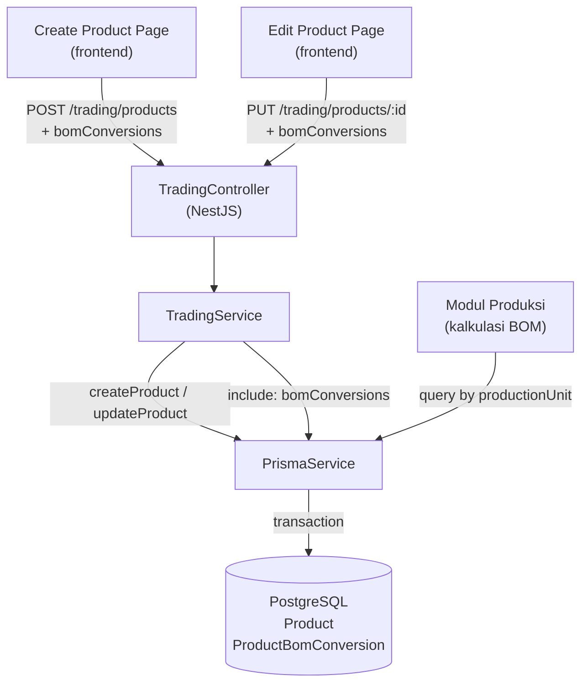

# Design Document: Konversi ke BOM (Catalog Product BOM Conversion)

## Overview

Fitur ini menambahkan kemampuan konversi satuan dari produk katalog (trading) ke satuan produksi (BOM) pada platform Sentra Dapur MBG. Supplier mendefinisikan faktor konversi saat mendaftarkan atau mengedit produk, sehingga modul produksi dapat menghitung kebutuhan bahan baku dalam satuan katalog secara otomatis.

Contoh: Produk "Beras" dijual dalam satuan TON. Tim produksi menggunakan satuan gram. Dengan `conversionFactor = 1_000_000`, sistem tahu bahwa 1 TON = 1.000.000 gram, sehingga jika BOM membutuhkan 500.000 gram, maka dibutuhkan 0.5 TON dari katalog.

## Architecture

Fitur ini mengikuti arsitektur yang sudah ada: NestJS (backend) + Prisma (ORM) + PostgreSQL (database) + Next.js 14 (frontend).



Perubahan yang diperlukan:
- **Database**: Tambah model `ProductBomConversion` di Prisma schema
- **Backend**: Extend `TradingService` dan `TradingController` untuk handle `bomConversions`
- **Frontend**: Tambah section "Konversi ke BOM" di halaman create dan edit produk
- **Frontend Service**: Extend `tradingService` untuk menyertakan `bomConversions` di payload

## Components and Interfaces

### Backend: TradingService

Method yang dimodifikasi:

```typescript
// createProduct — tambah parameter bomConversions opsional
createProduct(sellerId: string, data: {
  name: string;
  description: string;
  prices: Array<{ currency: 'IDR' | 'USD'; price: number }>;
  unit: string;
  weight: number;
  volume: string;
  status?: ProductStatus;
  bomConversions?: Array<{ productionUnit: string; conversionFactor: number }>;
})

// applyProductFieldsUpdate — tambah bomConversions ke replace strategy
applyProductFieldsUpdate(id: string, data: Partial<{
  name: string;
  description: string;
  prices: Array<{ currency: 'IDR' | 'USD'; price: number }>;
  unit: string;
  weight: number;
  volume: string;
  bomConversions?: Array<{ productionUnit: string; conversionFactor: number }> | null;
}>)
```

Method baru:

```typescript
// Query konversi BOM berdasarkan productionUnit (untuk modul produksi)
getBomConversionsByUnit(productionUnit: string): Promise<ProductBomConversion[]>
```

### Backend: TradingController

Endpoint yang dimodifikasi — body type diperluas:

```typescript
// POST /trading/products
body: {
  ...existing fields...
  bomConversions?: Array<{ productionUnit: string; conversionFactor: number }>;
}

// PUT /trading/products/:id
body: Partial<{
  ...existing fields...
  bomConversions?: Array<{ productionUnit: string; conversionFactor: number }> | null;
}>
```

Endpoint baru:

```typescript
// GET /trading/bom-conversions?productionUnit=gram
// Digunakan oleh modul produksi untuk kalkulasi kebutuhan bahan baku
@Get('bom-conversions')
getBomConversionsByUnit(@Query('productionUnit') productionUnit: string)
```

### Frontend: tradingService

Method yang dimodifikasi:

```typescript
createProduct(payload: {
  ...existing fields...
  bomConversions?: Array<{ productionUnit: string; conversionFactor: number }>;
})

updateProduct(id: string, payload: Partial<{
  ...existing fields...
  bomConversions?: Array<{ productionUnit: string; conversionFactor: number }> | null;
}>)
```

Method baru:

```typescript
getBomConversionsByUnit(productionUnit: string): Promise<BomConversionResult[]>
```

### Frontend: BomConversionRow Component

Komponen UI untuk satu baris konversi BOM:

```typescript
interface BomConversionRowProps {
  index: number;
  productionUnit: string;
  conversionFactor: string; // string untuk controlled input
  catalogUnit: string; // unit katalog produk (untuk label preview)
  onChange: (index: number, field: 'productionUnit' | 'conversionFactor', value: string) => void;
  onRemove: (index: number) => void;
  errors?: { productionUnit?: string; conversionFactor?: string };
}
```

## Data Models

### Prisma Schema — Model Baru

```prisma
model ProductBomConversion {
  id              String   @id @default(uuid())
  product         Product  @relation(fields: [productId], references: [id], onDelete: Cascade)
  productId       String
  productionUnit  String   // satuan produksi, e.g. "gram", "ml", "liter"
  conversionFactor Float   // jumlah satuan produksi per 1 satuan katalog
  createdAt       DateTime @default(now())
  updatedAt       DateTime @updatedAt

  @@unique([productId, productionUnit])
  @@index([productId])
  @@index([productionUnit])
}
```

### Modifikasi Model Product

Tambah relasi ke `ProductBomConversion`:

```prisma
model Product {
  // ... existing fields ...
  bomConversions ProductBomConversion[]
}
```

### TypeScript Types (Frontend)

```typescript
export interface BomConversion {
  id: string;
  productId: string;
  productionUnit: string;
  conversionFactor: number;
  createdAt: string;
  updatedAt: string;
}

export interface BomConversionInput {
  productionUnit: string;
  conversionFactor: number;
}
```

### Response Shape

Semua endpoint GET produk akan menyertakan:

```json
{
  "id": "...",
  "name": "Beras Premium",
  "unit": "TON",
  "bomConversions": [
    { "id": "...", "productionUnit": "gram", "conversionFactor": 1000000 },
    { "id": "...", "productionUnit": "kg", "conversionFactor": 1000 }
  ]
}
```

## Correctness Properties

*A property is a characteristic or behavior that should hold true across all valid executions of a system — essentially, a formal statement about what the system should do. Properties serve as the bridge between human-readable specifications and machine-verifiable correctness guarantees.*

### Property 1: Cascade delete menghapus semua konversi BOM

*For any* produk yang memiliki satu atau lebih `ProductBomConversion`, ketika produk tersebut dihapus, query `ProductBomConversion` dengan `productId` yang sama harus mengembalikan array kosong.

**Validates: Requirements 1.3**

---

### Property 2: Create produk menyimpan semua konversi BOM

*For any* array `bomConversions` yang valid (semua `conversionFactor > 0` dan `productionUnit` tidak kosong), setelah `createProduct` berhasil, semua konversi dalam array tersebut harus dapat di-query dari database dengan nilai yang identik.

**Validates: Requirements 2.1, 2.6**

---

### Property 3: Validasi conversionFactor menolak nilai tidak valid

*For any* nilai `conversionFactor` yang kurang dari atau sama dengan 0, request `createProduct` atau `updateProduct` yang menyertakan konversi dengan nilai tersebut harus ditolak dengan HTTP 400.

**Validates: Requirements 2.4**

---

### Property 4: Validasi productionUnit menolak string kosong/whitespace

*For any* string `productionUnit` yang hanya berisi karakter whitespace (termasuk string kosong `""`), request `createProduct` atau `updateProduct` yang menyertakan konversi dengan nilai tersebut harus ditolak dengan HTTP 400.

**Validates: Requirements 2.5**

---

### Property 5: Replace strategy mengganti seluruh konversi BOM

*For any* produk dengan set konversi awal S1, setelah `updateProduct` dengan set konversi baru S2 (S2 tidak null/undefined), konversi yang tersimpan di database harus persis sama dengan S2 — tidak ada sisa dari S1 yang tidak ada di S2.

**Validates: Requirements 3.1, 3.4**

---

### Property 6: Authorization — supplier tidak bisa update produk milik supplier lain

*For any* produk milik supplier A, jika supplier B (B ≠ A) mencoba melakukan `updateProduct` pada produk tersebut, sistem harus mengembalikan HTTP 403.

**Validates: Requirements 3.5**

---

### Property 7: Semua endpoint GET produk menyertakan field bomConversions

*For any* produk yang ada di database, response dari endpoint `GET /trading/products/:id`, `GET /trading/products`, dan `GET /trading/seller/products` harus selalu menyertakan field `bomConversions` berupa array (bisa kosong `[]`, tidak boleh `null` atau `undefined`).

**Validates: Requirements 4.1, 4.2, 4.3, 4.4**

---

### Property 8: Query konversi BOM berdasarkan productionUnit mengembalikan hasil yang tepat

*For any* nilai `productionUnit`, query `getBomConversionsByUnit(productionUnit)` harus mengembalikan semua dan hanya konversi yang memiliki `productionUnit` yang sama persis — tidak ada yang terlewat, tidak ada yang salah masuk.

**Validates: Requirements 7.2**

---

### Property 9: Formula konversi satuan produksi ke satuan katalog

*For any* nilai `total_produksi > 0` dan `conversionFactor > 0`, hasil kalkulasi `jumlah_katalog = total_produksi / conversionFactor` harus menghasilkan nilai yang secara matematis benar (dalam toleransi floating-point).

**Validates: Requirements 7.3**

---

### Property 10: Label preview konversi di UI mencerminkan nilai input

*For any* nilai `catalogUnit`, `conversionFactor`, dan `productionUnit` yang diisi di form, label preview yang ditampilkan harus menampilkan string `"1 {catalogUnit} = {conversionFactor} {productionUnit}"` dengan nilai yang sesuai.

**Validates: Requirements 5.4**

---

### Property 11: Jumlah baris konversi di UI sesuai dengan aksi tambah/hapus

*For any* urutan aksi tambah dan hapus baris konversi di form, jumlah baris yang ditampilkan harus selalu sama dengan jumlah total aksi tambah dikurangi jumlah total aksi hapus.

**Validates: Requirements 5.3, 5.5, 6.3**

---

**Property Reflection:**

Setelah review, Properties 2 dan 7 saling melengkapi (bukan redundan): Property 2 memvalidasi sisi write (create), Property 7 memvalidasi sisi read (GET). Properties 3 dan 4 keduanya diperlukan karena memvalidasi dua jenis validasi yang berbeda (numeric vs string). Properties 5 dan 2 tidak redundan karena Property 5 memvalidasi replace strategy pada update, bukan create. Properties 10 dan 11 adalah UI properties yang independen. Semua properties dipertahankan.

## Error Handling

### Backend

| Kondisi | HTTP Status | Pesan |
|---|---|---|
| `conversionFactor <= 0` | 400 | "conversionFactor harus lebih besar dari 0" |
| `productionUnit` kosong/whitespace | 400 | "productionUnit tidak boleh kosong" |
| Duplikat `productionUnit` pada produk yang sama | 400 | "productionUnit sudah terdaftar untuk produk ini" |
| Produk tidak ditemukan | 404 | "Product not found" |
| Supplier bukan pemilik produk | 403 | "You do not have permission to update this product" |

Validasi dilakukan di layer service sebelum operasi database. Jika ada satu konversi yang tidak valid dalam array, seluruh request ditolak (fail-fast).

### Frontend

- Validasi client-side dilakukan sebelum submit: `conversionFactor` harus > 0, `productionUnit` tidak boleh kosong/whitespace
- Error per-baris ditampilkan di bawah field yang bermasalah
- Error dari backend ditampilkan di bagian atas form
- Form tidak bisa disubmit jika ada baris konversi yang tidak valid

## Testing Strategy

### Unit Tests (Backend)

Fokus pada logika validasi dan transformasi data di `TradingService`:

- Test `createProduct` dengan berbagai kombinasi `bomConversions` (valid, kosong, tidak ada)
- Test `applyProductFieldsUpdate` dengan replace strategy (S1 → S2, S1 → [], S1 → undefined)
- Test validasi `conversionFactor <= 0` dan `productionUnit` whitespace
- Test `getBomConversionsByUnit` dengan berbagai `productionUnit`

### Property-Based Tests (Backend)

Menggunakan library **fast-check** (TypeScript/Node.js) dengan minimum 100 iterasi per property.

Setiap property test diberi tag komentar:
`// Feature: catalog-product-bom-conversion, Property {N}: {property_text}`

- **Property 1**: Generate produk dengan N konversi (N dari 1–10), hapus produk, verifikasi konversi kosong
- **Property 2**: Generate array bomConversions valid, createProduct, verifikasi semua tersimpan
- **Property 3**: Generate conversionFactor <= 0 (0, negatif, -Infinity), verifikasi HTTP 400
- **Property 4**: Generate string whitespace-only (spasi, tab, newline, kombinasi), verifikasi HTTP 400
- **Property 5**: Generate S1 dan S2 sebagai dua set konversi berbeda, update S1→S2, verifikasi hanya S2 yang ada
- **Property 6**: Generate dua userId berbeda, verifikasi 403 untuk userId yang bukan pemilik
- **Property 7**: Generate produk dengan 0–5 konversi, verifikasi semua GET endpoint menyertakan bomConversions array
- **Property 8**: Generate beberapa produk dengan berbagai productionUnit, query by unit, verifikasi hasil tepat
- **Property 9**: Generate total_produksi dan conversionFactor positif, verifikasi formula matematika

### Property-Based Tests (Frontend)

Menggunakan **fast-check** dengan React Testing Library:

- **Property 10**: Generate catalogUnit, conversionFactor, productionUnit; render BomConversionRow; verifikasi label
- **Property 11**: Generate urutan aksi tambah/hapus; verifikasi jumlah baris

### Integration Tests

- Test endpoint `POST /trading/products` dengan `bomConversions` end-to-end ke database test
- Test endpoint `PUT /trading/products/:id` dengan replace strategy end-to-end
- Test endpoint `GET /trading/products/:id` memastikan `bomConversions` ada di response
- Test endpoint `GET /trading/bom-conversions?productionUnit=gram` end-to-end

### Unit Tests (Frontend)

- Test `BomConversionRow` component: render, onChange, onRemove
- Test validasi form: submit dengan konversi tidak valid harus diblokir
- Test submit tanpa konversi BOM tetap berhasil (opsional)
- Test load data edit: `bomConversions` dari API ditampilkan sebagai baris form
